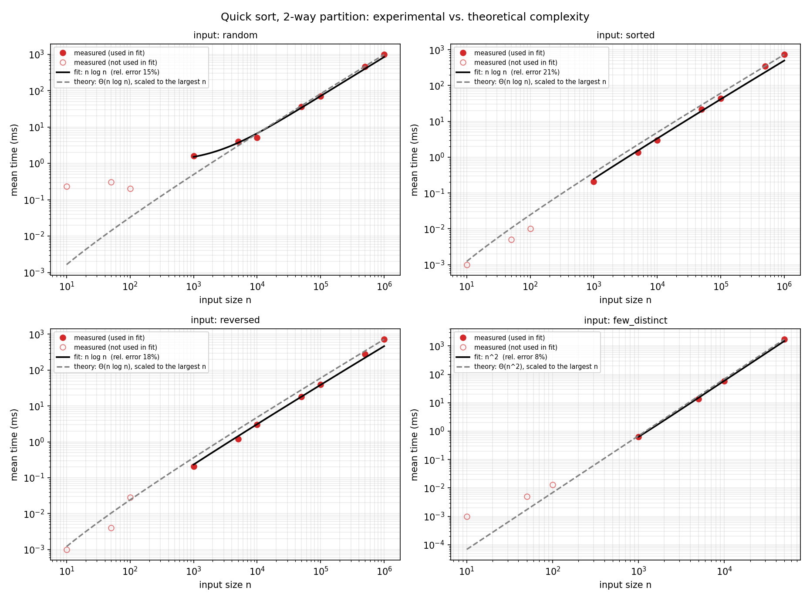
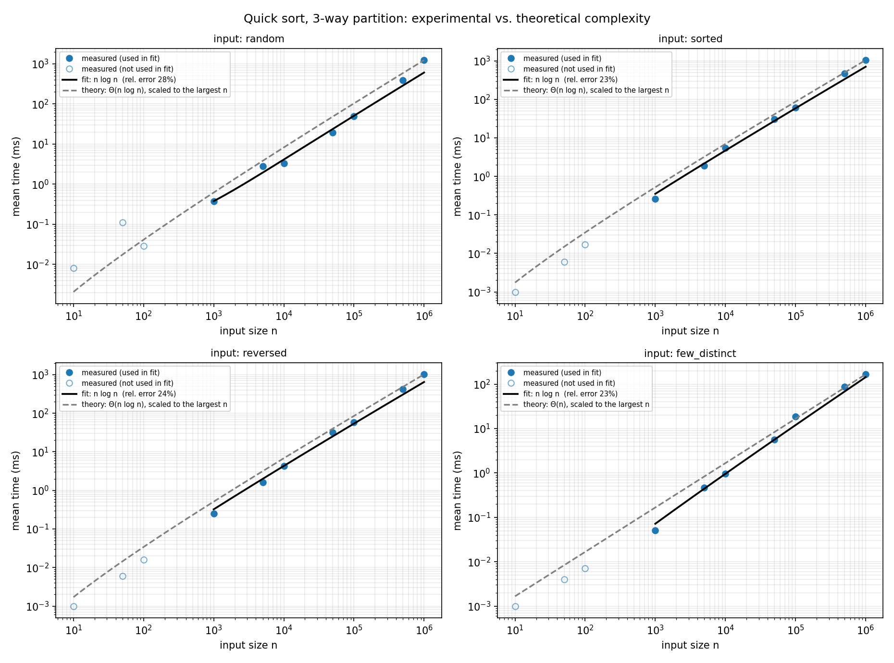
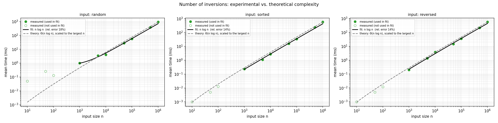
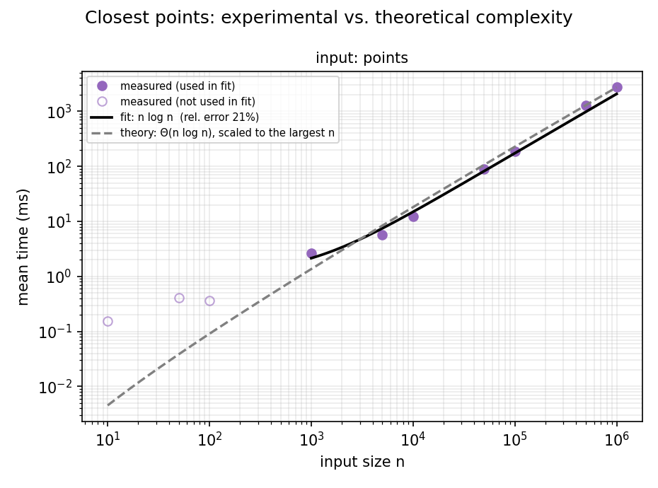
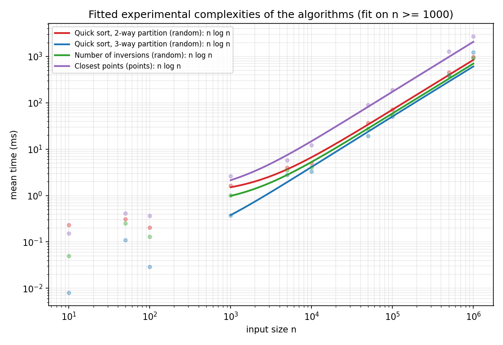
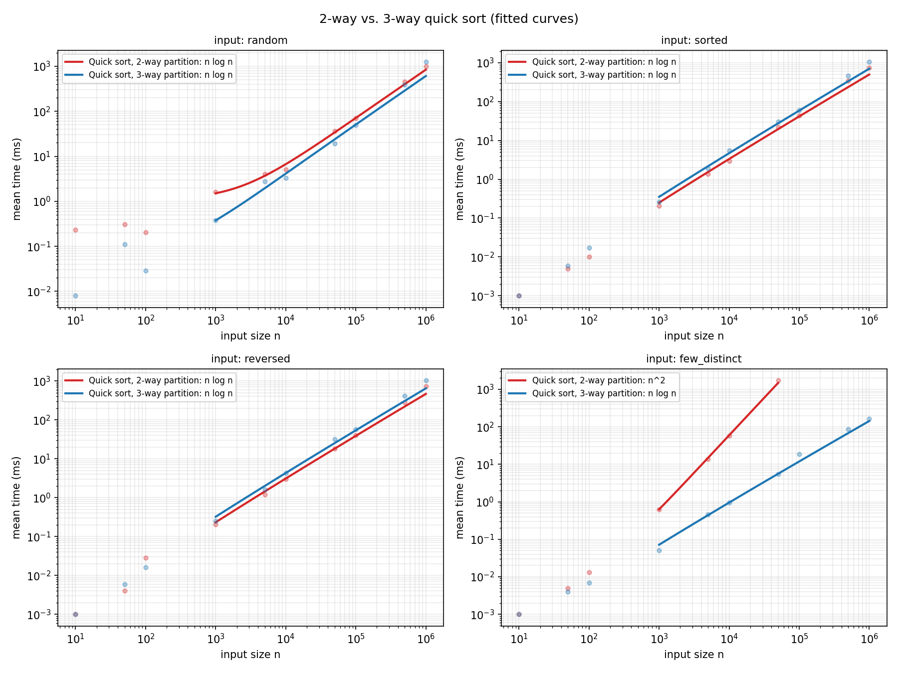

# Experiments report (Part 2)

This report measures the running time of the algorithms of the three problems on inputs of
increasing size, fits an analytic function to the measurements and compares it with the
theoretical complexity of `doc/complexity.md`.

All numbers come from `results/timings.csv` and `results/fits.csv`, and all figures from
`scripts/plots.py`. The experiments were **re-run from scratch** in a controlled environment, so
this report replaces any earlier version.

## 1. Execution environment

| Item | Value |
| ---- | ----- |
| Processor | 12th Gen Intel Core i5-12500H (12 cores, 16 logical processors) |
| RAM | 16 GB |
| Operating system | Windows 11 (10.0), amd64 |
| JVM | Java 17.0.18, options `-Xmx4g` (max heap 4096 MB) |
| Language / build | Scala 3.9.0, sbt |
| Timer | `System.nanoTime` around each run (`Experiments.Timer`) |

The same data is in `results/environment.txt`.

Conditions used to control the variables that do not depend on the algorithm:

- All the experiments ran in a single session, on one machine, with one JVM configuration.
- No other applications were running during the measurements.
- The inputs are generated once with fixed seeds, saved in `data/` and loaded from disk, so every
  algorithm and every repetition reads exactly the same data. Loading and generating happen
  **before** the clock starts: only the algorithm is timed.
- Pivots of the randomized quick sort come from a pure pseudo-random function with a fixed seed,
  so the runs are reproducible.
- <!-- TODO (team): confirm and keep only what is true: laptop plugged in, "high performance"
  power plan, battery saver off, no background updates, cool machine before starting. -->

Because the CPU is a laptop processor, some thermal or power-management noise cannot be ruled
out (see section 5.7).

## 2. Method

- **Repetitions.** Every (algorithm, input) pair is run 10 times. The **first run is discarded**
  because the JVM is still compiling the code (JIT warm-up), and the mean of the other 9 is
  reported (`ExperimentRunner.measure`).
- **Metric.** Execution time in milliseconds.
- **Scenarios.**

| Scenario | Description | Used by |
| -------- | ----------- | ------- |
| `random` | integers spread over a wide range (few repeated values) | quick sort (both), inversions |
| `sorted` | distinct integers, increasing order | quick sort (both), inversions |
| `reversed` | distinct integers, decreasing order (maximum number of inversions) | quick sort (both), inversions |
| `few_distinct` | integers taken from a handful of distinct values | quick sort (both) |
| `points` | points of the plane, each one a list of two integers | closest points |

### Input sizes

The assignment defines four categories. The sizes used for each one are:

| Category | Definition | Sizes used |
| -------- | ---------- | ---------- |
| Toy | n < 10² | 10, 50 |
| Small | 10² ≤ n < 10⁴ | 100, 1 000, 5 000 |
| Medium | 10⁴ ≤ n < 10⁵ | 10 000, 50 000 |
| Large | n ≥ 10⁶ | 1 000 000 |
| *(between medium and large)* | 10⁵ ≤ n < 10⁶ | 100 000, 500 000 |

The two sizes of the last row are not in any category of the statement. They were added on
purpose: without them there would be no data between 5·10⁴ and 10⁶, and the fitted curves would
rest on too few points in the range that matters most.

Two decisions that affect the data:

- **Sizes below 1 000 are drawn but not used for fitting.** With a few microseconds per run,
  the timer resolution and the JIT warm-up dominate the measurement (hollow points in the
  figures).
- **`quicksort_2way` with `few_distinct` stops at n = 50 000.** It is quadratic there (1.7 s at
  n = 50 000) and a run of 10⁶ elements would take hours. Its fit therefore uses only 4 points
  (n = 1 000 … 50 000) and is the least reliable of all.

## 3. Data fitting method

For each algorithm and scenario three candidate functions `a·f(n) + b` (with `a, b ≥ 0`) were
fitted by non-negative least squares on the sizes n ≥ 1 000, with `f(n) ∈ {n, n log n, n²}`.
Since times span six orders of magnitude, the fit minimizes the **relative** error, otherwise
only the largest sizes would count. The best model is the one with the lowest relative RMSE.

We also report the **empirical exponent** `k` of `t ≈ c·nᵏ`, obtained from a log-log regression.
A useful reference: for `n log n` the local exponent is `1 + 1/ln n`, which is about **1.14 at
n = 10³ and 1.07 at n = 10⁶**. A pure `n log n` algorithm measured on 10³–10⁶ should therefore show
`k` slightly above 1 (around 1.1), and `n²` should show `k ≈ 2`.

The dashed "theory" line in each figure is the theoretical function, scaled so that it passes
through the measurement at the largest n. It only shows the *shape* of the theoretical growth;
its vertical position carries no meaning (see the remark on this in section 5.7).

## 4. Results

### 4.1 Best fit per algorithm and input

| Algorithm | Input | Theory | Best fit | Rel. error | R² | Exponent k |
| --------- | ----- | ------ | -------- | ---------- | -- | ---------- |
| Quick sort 2-way | random | n log n | n log n | 15.1 % | 0.971 | 0.97 |
| Quick sort 2-way | sorted | n log n | n log n | 20.6 % | 0.856 | 1.19 |
| Quick sort 2-way | reversed | n log n | n log n | 18.2 % | 0.842 | 1.18 |
| Quick sort 2-way | few_distinct | n² | **n²** | 8.1 % | 0.976 | **2.02** |
| Quick sort 3-way | random | n log n | n log n | 27.9 % | 0.678 | 1.15 |
| Quick sort 3-way | sorted | n log n | n log n | 22.9 % | 0.857 | 1.19 |
| Quick sort 3-way | reversed | n log n | n log n | 23.7 % | 0.826 | 1.20 |
| Quick sort 3-way | few_distinct | n | n log n | 22.7 % | 0.962 | 1.17 |
| Number of inversions | random | n log n | n log n | 17.7 % | 0.930 | 1.01 |
| Number of inversions | sorted | n log n | n log n | 13.8 % | 0.919 | 1.14 |
| Number of inversions | reversed | n log n | n log n | 14.4 % | 0.946 | 1.12 |
| Closest points | points | n log n | n log n | 20.5 % | 0.920 | 1.06 |

The complete table, with the three models of every case, is in `results/fits.csv`.

### 4.2 Selected measurements (mean time in ms)

| Algorithm / input | n = 10³ | n = 10⁴ | n = 10⁵ | n = 10⁶ |
| ----------------- | ------: | ------: | ------: | ------: |
| Quick sort 2-way, random | 1.62 | 5.04 | 70.7 | 986 |
| Quick sort 2-way, few_distinct | 0.63 | 58.5 | — | — |
| Quick sort 3-way, random | 0.38 | 3.29 | 49.7 | 1 240 |
| Quick sort 3-way, few_distinct | 0.05 | 0.96 | 18.6 | 166 |
| Number of inversions, random | 1.00 | 4.04 | 55.4 | 918 |
| Number of inversions, reversed | 0.20 | 3.84 | 34.9 | 564 |
| Closest points | 2.61 | 12.2 | 188 | 2 722 |

### 4.3 Figures per algorithm

Each figure shows the measurements, the best fitting curve and the theoretical complexity as a
reference.

**Quick sort, 2-way partition**



**Quick sort, 3-way partition**



**Number of inversions**



**Closest points**



### 4.4 Comparison between algorithms

Fitted curves of the four algorithms on one graph (main scenario of each one):



Comparison of the two quick sorts in every scenario:



Observations:

- At n = 10⁶ the order from fastest to slowest is: inversions (≈ 0.9 s, sorted/reversed ≈ 0.56 s),
  quick sort (≈ 1 s), closest points (≈ 2.7 s). Closest points is the most expensive, probably because its
  linear step does more work per level (strip construction, y-merge and scan, plus the initial
  sort by x); we did not profile it. All of them grow with the same shape, as expected for Θ(n log n).
- With **few distinct values** the 3-way partition is dramatically faster than the 2-way:
  12× at n = 10³, 61× at n = 10⁴ and **308× at n = 5·10⁴** (5.6 ms against 1 717 ms). The gap
  grows with n because one algorithm is Θ(n²) and the other is close to linear.
- With **distinct values** the 3-way has no real advantage. On sorted and reversed inputs it is
  consistently about 1.4× slower than the 2-way (for example 1 048 ms against 737 ms at
  n = 10⁶). On random inputs the result is mixed: it is faster for n ≤ 5·10⁵ (1.4× to 1.9× for
  most sizes) and slower at n = 10⁶ (1 240 ms against 986 ms), where the outlier of 5.6
  appears (see also 5.4).

## 5. Answers to the guiding questions

### 5.1 Is there a discernible pattern between input size and running time?

Yes. In log-log scale all the measurements (for n ≥ 10³) fall almost on a straight line with a
slope slightly above 1: multiplying n by 10 multiplies the time by about 12–17 (for example
inversions, random: 4.0 ms → 55 ms → 918 ms for n = 10⁴, 10⁵, 10⁶). That is the signature of
`n log n`, not of `n²` (which would give ×100). The only exception is the 2-way quick sort with
few distinct values, where five times more data costs about 29 times more (58 ms at 10⁴, 1.7 s at
5·10⁴; a quadratic algorithm predicts ×25), a quadratic pattern.

### 5.2 What kind of relationship appears to exist?

Quasi-linear (`n log n`) for the three problems in all scenarios, and **quadratic** only for the
2-way quick sort on inputs with few distinct values. The empirical exponents agree: between 1.0
and 1.2 for the `n log n` cases and 2.02 for the quadratic one.

### 5.3 Which function fits the experimental data best?

`n log n` for eleven of the twelve cases, and `n²` for `quicksort_2way / few_distinct`. Among the
eleven, `quicksort_3way / few_distinct` is the only one where the theory predicts something
different (Θ(n), see 5.4).

The quality of the fits is moderate: relative errors are between 8 % and 28 % and R² is between
0.68 and 0.98. This is expected with only 7 points per curve (4 in the 2-way/few_distinct case)
and with times that include JIT, garbage collector and memory-hierarchy effects. We therefore
use the empirical exponent as a second, independent criterion, and both agree.

One case deserves a comment: for `quicksort_3way / random` the model `n²` has a higher R²
(0.887) than `n log n` (0.678). `n log n` was still chosen because it has the lowest relative
error (27.9 % against 59.8 %), and its exponent (1.15) is far from 2. The low R² of `n log n`
comes mainly from the point n = 10⁶ (see 5.6).

### 5.4 How does the fitted function compare with the theoretical complexity?

| Case | Theory | Fit | Agreement |
| ---- | ------ | --- | --------- |
| Inversions (all inputs) | Θ(n log n) | n log n, k = 1.01–1.14 | yes |
| Closest points | Θ(n log n) | n log n, k = 1.06 | yes |
| Quick sort 2-way, distinct values | Θ(n log n) average | n log n, k = 0.97–1.19 | yes |
| Quick sort 3-way, distinct values | Θ(n log n) average | n log n, k = 1.15–1.20 | yes |
| Quick sort 2-way, few_distinct | Θ(n²) | n², k = 2.02 | yes |
| Quick sort 3-way, few_distinct | O(n log d) with d constant, i.e. Θ(n) | n log n, k = 1.17 | partly |

Two points to note:

- **Sorted and reversed inputs are not bad cases** for either quick sort, because the pivot is
  chosen pseudo-randomly. The measurements confirm it: they behave like `n log n`, not like
  `n²`. Their exponent (≈ 1.19) is a bit larger than for random inputs, which we attribute to
  memory-access patterns of the linked lists, although we did not measure this directly.
- **3-way with few distinct values** is theoretically linear (the recursion has a constant
  number of distinct keys), but the measured exponent is 1.17 and `n log n` fits better than `n`
  (22.7 % against 43.4 % relative error). The recurrence ignores the constant cost of list
  allocation and garbage collection, which grows with n on the JVM, and the data covers only
  three decades. The measurement still shows the main effect (a gap of up to 308× against the
  2-way), but it does not confirm a perfectly linear growth.

The **3-way partition gives no gain with distinct values** and is clearly slower on sorted and
reversed inputs. It is `n log n` like the 2-way, and a plausible reason for the larger constant is
that `partition3` makes up to two comparisons per element and builds three result lists, a cost
that only pays off when there are repeated values (we did not profile it to confirm this). This
is a trade-off, not a defect.

### 5.5 Does the theoretical complexity predict the observed time adequately?

For the *shape* of the growth, yes: the recurrences `T(n) = 2T(n/2) + Θ(n)` predict the
quasi-linear growth observed, and the quadratic recurrence of the 2-way quick sort with equal
elements predicts the 2.02 exponent. For the *absolute time*, no, and it is not meant to:
asymptotic analysis hides constants. In particular, the same Θ(n log n) gives times at n = 10⁶
that range from 0.56 s to 2.7 s depending on the algorithm and the input.

### 5.6 Is there any input size with unusual behavior?

- **Very small sizes (n ≤ 100).** Times are not monotonic: for example `quicksort_2way` random
  takes 0.233 ms for n = 10 but 0.203 ms for n = 100, and `closest_points` takes 0.413 ms for
  n = 50 but 0.365 ms for n = 100. At these sizes a run lasts
  microseconds, and JIT compilation and timer resolution dominate. These points are not used
  for the fits.
- **`quicksort_3way` at n = 10⁶.** This is the clearest outlier. Doubling n from 5·10⁵ to 10⁶
  should multiply the time by about 2.1 (`n log n`), as it does for `quicksort_2way` (×2.16) or
  `closest_points` (×2.14). Instead, `quicksort_3way` on random inputs goes from 392 ms to
  1 240 ms (**×3.16**), and it is slower than the 2-way (986 ms). A similar, milder effect
  appears on reversed inputs (×2.44) and inversions (×2.4–2.6). We did not isolate the cause; a
  plausible explanation is memory pressure and garbage collection with lists of a million
  elements (max heap 4 GB). Verifying it would require GC logs (`-Xlog:gc`) or repeating the
  point with a larger heap.

### 5.7 Possible sources of error or bias

- **JIT and garbage collector.** The first run is discarded to reduce JIT effects, but the GC
  can still introduce pauses in some runs, mostly with n ≥ 5·10⁵. The report only keeps the
  mean of 9 runs; it does not store the individual times or the standard deviation, so the
  spread cannot be quantified.
- **Single input per size.** Every repetition runs on the same input. Results therefore measure
  the variability of the machine, not of the data (a different random list could behave a bit
  differently).
- **Machine.** A laptop CPU (i5-12500H) can change frequency because of temperature or power
  settings during a long session.
- **Few points for fitting.** Seven points per curve (four for `quicksort_2way / few_distinct`)
  make the choice of the best model sensitive to a single noisy point such as
  `quicksort_3way` at n = 10⁶.
- **Candidate models.** Only `n`, `n log n` and `n²` were considered; a function such as
  `n log² n` or `n^1.1` could fit better in some cases and was not tried.
- **Scaled theory line.** The theoretical curve is anchored at the largest size, so an outlier
  there shifts the whole line (this is visible in the 3-way / random panel, where the dashed line
  lies above all the other points).
- **Sequential experiments in one JVM.** The algorithms are run one after another in the same
  process, so the JVM state left by one experiment (compiled code, heap occupancy) can affect
  the next.

## 6. Conclusions

1. The three algorithms behave as `n log n` in all the scenarios, as predicted by their
   recurrences, and the 2-way quick sort behaves as `n²` when there are many equal elements.
2. The 3-way partition fixes that problem: with few distinct values it is up to 308× faster at
   n = 5·10⁴ and grows almost linearly. With distinct values it gives no consistent gain and is
   about 1.4× slower on sorted and reversed inputs.
3. Absolute times are noisy at both ends of the range (JIT for small n, memory/GC for the largest
   ones), so the conclusions rest on the growth pattern and on the empirical exponents more than
   on the exact value of any single measurement.

## 7. How to reproduce

```bash
sbt "runMain Experiments.Main full"     # writes results/timings.csv and results/environment.txt
pip install -r scripts/requirements.txt
python scripts/plots.py                 # writes doc/img/*.png and results/fits.csv
```

Add the processor model and the RAM by hand to `results/environment.txt` after the run, because
the JVM does not report them.